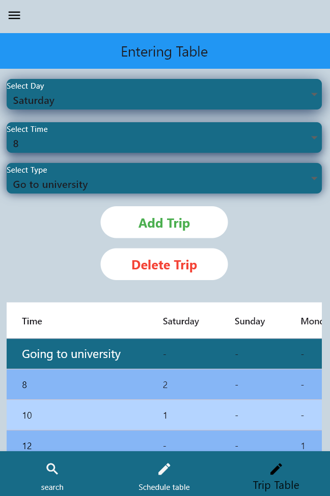
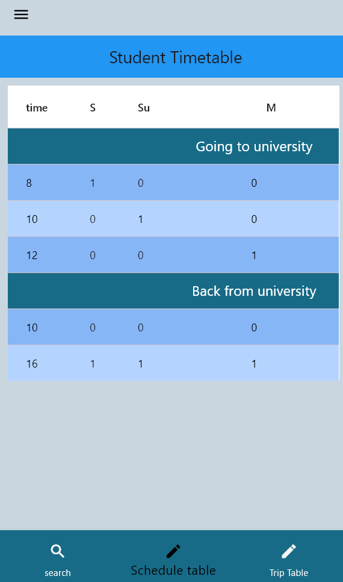

# University Student Transportation Management App

## Project Description
This project is a **mobile application built using Flutter** that aims to **improve university student transportation management** by automating the scheduling of transport based on students' class schedules.  

Students can upload **images of their class schedules** to the app. These images are then **processed and analyzed using OCR technology (PyTesseract)** to extract class times and categorize them accurately. The system also determines **the number of students in each time slot and on each day**.  

The core idea is to **convert class schedules from images into usable digital data**, enabling the transportation company to:  
- Obtain a comprehensive schedule with class days and the number of students per time slot.  
- Organize university transport more efficiently and reduce resource wastage.  
- Send the **final transport schedule directly to students** through the app, ensuring a smooth and organized transportation experience.

## Tools and Technologies
- **Flutter & Dart**: For mobile app development.  
- **Python**: For data processing and image analysis.  
- **PyTesseract**: OCR technology for extracting text from images.  
- **OpenCV**: For image processing and enhancing schedule readability.  
- **NumPy**: For data analysis and processing.  
- **PHP & XAMPP**: For creating the database and backend server.  
- **Visual Studio Code**: Code Editor.

## Screenshots

  
    
  
    
  
    
  
    
  

